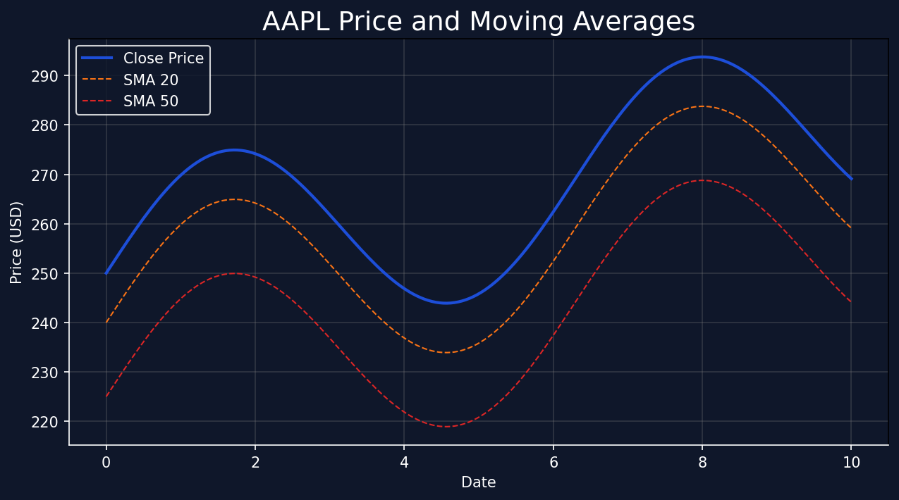

# Stock Forecasting Project

A simple Python project for downloading stock price data, running basic analysis, generating lightweight forecasts and my first github repository!

## Project Structure

- `main.py` — entry point and workflow orchestration
- `data/` — data retrieval and source definitions
- `analysis/` — technical indicator calculations and visualization helpers
- `models/` — forecasting and prediction utilities
- `utils/` — configuration and file I/O helpers

## Setup

1. Create a Python virtual environment:

```bash
python -m venv venv
venv\Scripts\activate
```

2. Install dependencies:

```bash
pip install -r requirements.txt
```

## Run

Fetch the default top 10 US stocks and run analysis:

```bash
python main.py
```

Specify custom symbols:

```bash
python main.py --symbols AAPL MSFT TSLA
```

Use a different source (default is Yahoo Finance):

```bash
python main.py --source yahoo
```

## Interactive Dashboard

Launch the Streamlit web dashboard for real-time visualization and analysis:

```bash
streamlit run dashboard.py
```

The dashboard includes:
- **Price & Indicators tab**: View stock prices, moving averages, RSI, and volatility
- **Forecasts tab**: Compare naive and moving-average forecasts
- **Data Export tab**: Download analyzed data as CSV

Configure the analysis in the sidebar:
- Select multiple stocks
- Choose historical period (1 month to 2 years)
- Set forecast horizon (1-30 days)

## Extending the project

- Add new data providers in `data/`
- Add more indicators in `analysis/indicators.py`
- Add machine learning models in `models/forecast.py`
- Save dashboards or reports using `analysis/visualization.py`
